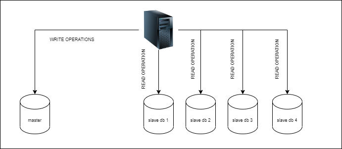
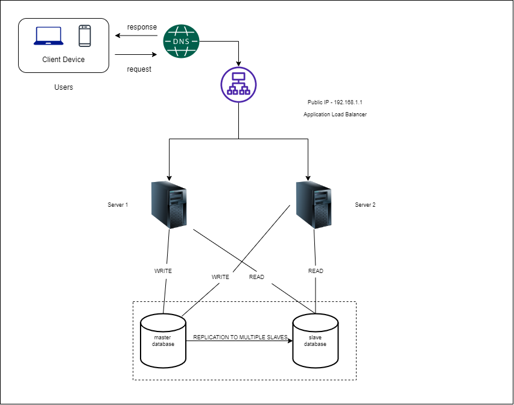

# Database Replication

A database replication can be done with a master/slave relationship. An original(master) database can contain many replica(slaves)
In general
```
- A master database should ideally support only write operations
- All Slave database should ideally support only read operations. 
- Number of slave database should be ideally > number of master database
```


Advantages for this approach

```
- Higher performance. As the number of read queries is always greater than write operation, many operations can be executed in parallel
- No single point of failure as there are multiple copies available
- High availablity as these copies can be available in different geo-locations
```

## What if resources start going down
```
- If the last available slave database goes down, the read operations will be TEMPORARILY redirected to the master database.
- If master database goes down, then one of the slave database is promoted to be master database and a new slave database is allocated immediately
```
