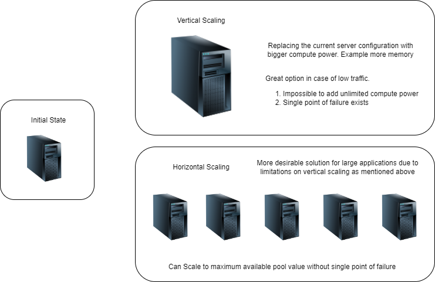
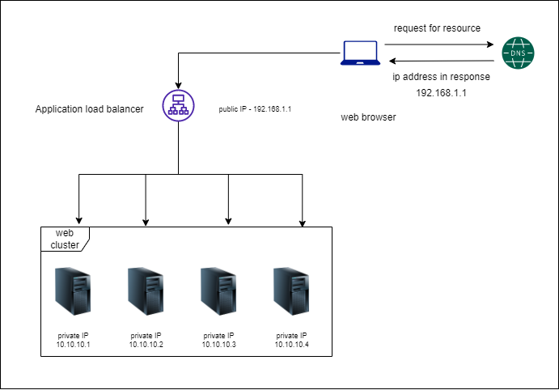

# Veritical Scaling / Scale Up

Vertical scaling means the process of adding more compute power to your server machine.

Drawbacks of vertical scaling

- Impossible to add unlimited compute power
- Single point of failure exists

# Horizontal Scaling / Scale Out

Horizontal Scaling means to add more servers to the available resource pool.

Single point of failure - If one resource (reference to server here) goes down, whole application goes down.

## Load Balancer

Since there are multiple servers now, on which server will be the client request sent ? 

### Load Balancer

A load balancer distributes the incooming traffic evenly between all the servers available in the resource pool. If there is only one server then all requests are redirected to the same server.

The load balancer has a public IP to which the client will redirect once the IP is obtained from DNS (DNS <-> Load Balancer's public IP). Once a request is hit on the load balancer it will use the private IP address to redirect the requests even through consistant hashing mechanism (ideally). 

Private IP is an IP that is reachable only within the same network. However will be unreachable from the internet. The load balancer communicates with the server through their private IP only. 