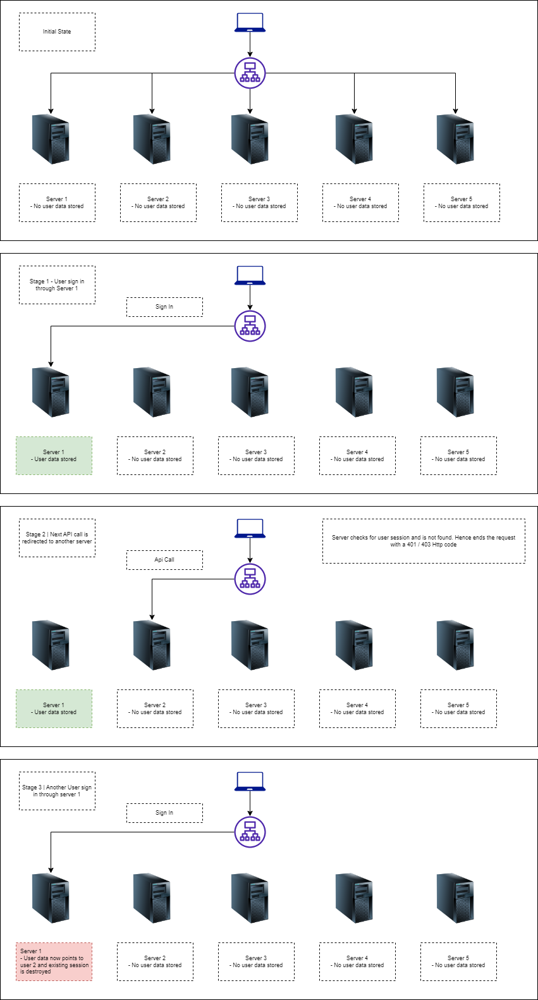
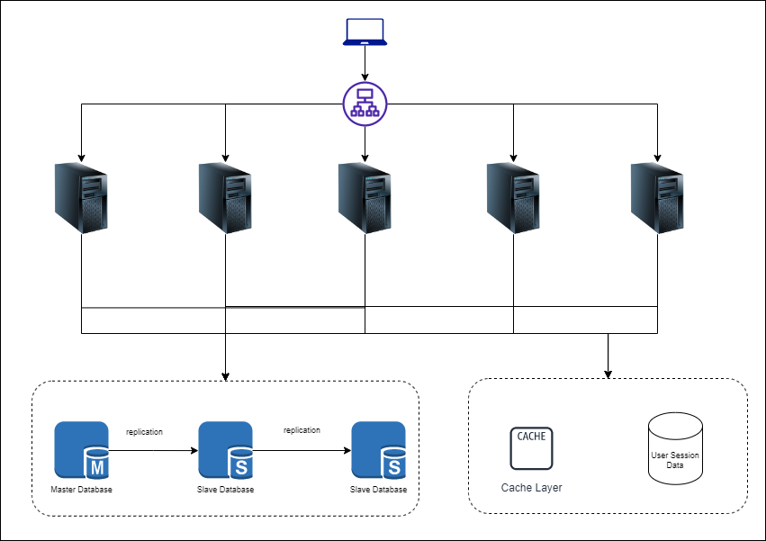

### Stateless Web tier

Once we start talking about horizontally scaling we need to talk about shared data between servers. 

Considering a scenario, 
- We have two web servers load balanced by an application load balancer and we have a sign in functionality. 
- Initally the request to sign in was responded with a JWT token from server 1. On sign in a user session is also created on this server
- The next request is redirected to server 2. 
- In the server 2 we have authorization grant that decodes the user information from session and allow / deny the request
- Since this user data (session) is not available in this server, the application starts denying the request with a 401 / 403 error.



On carefully observing the problem we can see that such a type of architecture where server remembers / need to remember client data in order to provide proper response is called a `Stateful architecture`.

One of the solutions to overcome the above mentioned problem is to used sticky sessions with load balancer, however this might not always be the best soluion.

To solve the problem we can move to a `Stateless architecture` which keeps no state information. In this architecture any request can be responded with any server where the current server pulls client data from a shared data store. This shared data store is kept out of any existing server to scale it independently. The updated state diagram can be viewed as - 



```
The user session database can be used as NoSQL since it would be easier data in a document format as well as to scale the database
```