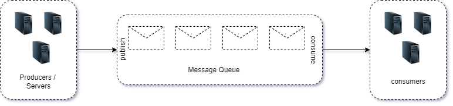
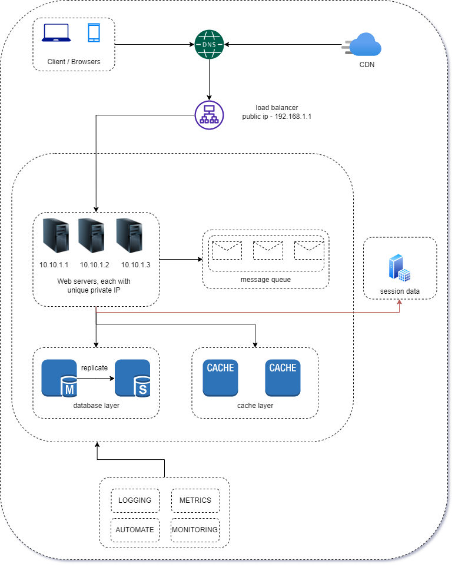

# Message Queue

Quoted from AWS - `Message Queue is a form of asynchronous service-to-service communication`. It generally works on producer/consumer mechanism 
The `Input services are called produces/publishers` The `servers are called consumers/subscribers` . One of the greatest reason to use message queue is the advantage of making system more failure tolerant and decoupled

After completing all topics from 1 - 6, there are some other enhancements to consider

## Logging

Loggin is a crucial element of an application as the system scales up. Meaningful logging also helps in well maintenance of the application and can help in debugging error faster. 

## Metrics

Metrics helps to get a generalised overview the different moving parts within the application. As the system scales, metrics can help understanding various warning that you might need to consider in future. It is also very helpful to understand the buffer with each resource that might be required. Some common metric parameters can be

1. Number of daily active users
2. Number of failed logins
3. Number of failed database queries
4. Performance of database, cache, or other layers

## Unit testing / Automation / CI/CD pipelines

This part is very essential for the application that tends to get larger quickly. It is best to keep documentation and unit testing maintained parallely as it can help detects problems very early, before the feature / bugs are deployed. Automation can help in taking this one step further where some automated tests are run before the actual deployment is made. 

Including all of these layers, our achitecture can now be visualized as following

